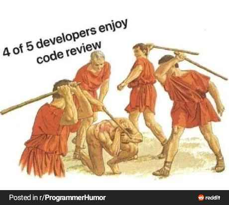
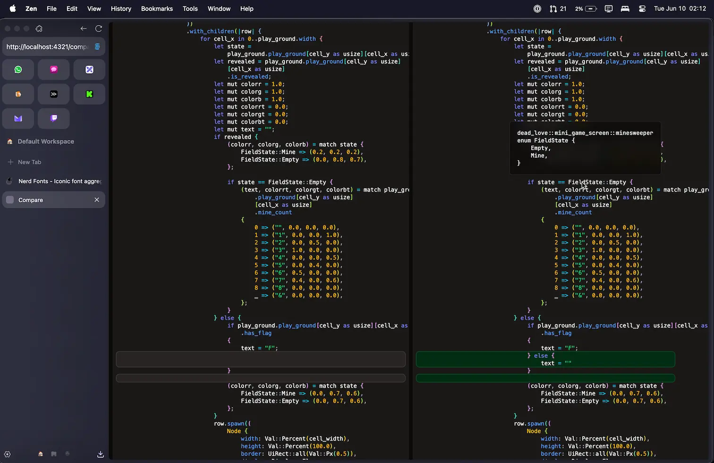

# ViewRe

Code reviews like you've never seen them before.

Many developers say that code reviews are a pain.  
One reason is the culture. Another reason is the tooling.

No tool can fix the culture in your team.
But ViewRe can replace your current tooling to make it easier for developers to look into code.
It provides the same functionality you get from an IDE but tailored for looking at diffs.

The goal of ViewRe is to reduce the hurdles when reviewing someone else's code.

## How it works

[go-git](https://github.com/go-git/go-git) is used to interact with Git repositories and create a patch between two commits.

[Tree-sitter](https://tree-sitter.github.io/tree-sitter/) parses the source code and generates an AST, which is then used for syntax highlighting and matching tokens to their location in the source code.

[LSP](https://microsoft.github.io/language-server-protocol/) is used to provide hover information and similar functionality based on the AST from [tree-sitter](https://tree-sitter.github.io/tree-sitter/).

## Installation

Coming soon

## Development

- [Docker](https://www.docker.com/)
- [Go](https://go.dev/)
- [Node.js](https://nodejs.org/en/) + [pnpm](https://pnpm.io/)
- [just](https://github.com/casey/just)
- [air](https://github.com/air-verse/air)

Run `just dev` to start the development server.

## License

ViewRe is a web-based code review tool licensed under the [GNU AGPL-3.0 License](https://www.gnu.org/licenses/agpl-3.0.html).  
Copyright (C) 2025  Frank Mayer

This program is free software: you can redistribute it and/or modify
it under the terms of the GNU Affero General Public License as published by
the Free Software Foundation, either version 3 of the License, or
(at your option) any later version.

This program is distributed in the hope that it will be useful,
but WITHOUT ANY WARRANTY; without even the implied warranty of
MERCHANTABILITY or FITNESS FOR A PARTICULAR PURPOSE. See the
GNU Affero General Public License for more details.

You should have received a copy of the GNU Affero General Public License
along with this program.  If not, see <https://www.gnu.org/licenses/>.

